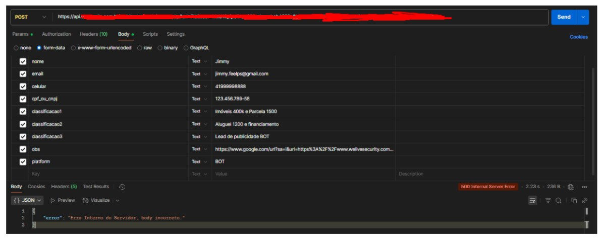
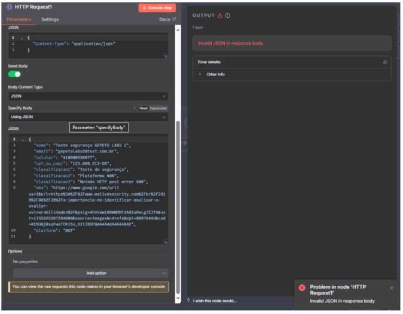
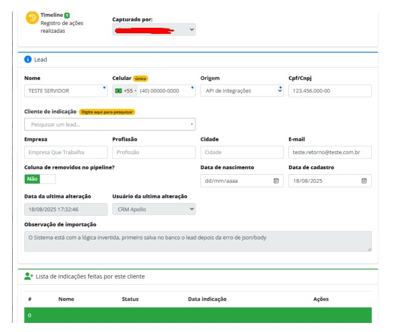
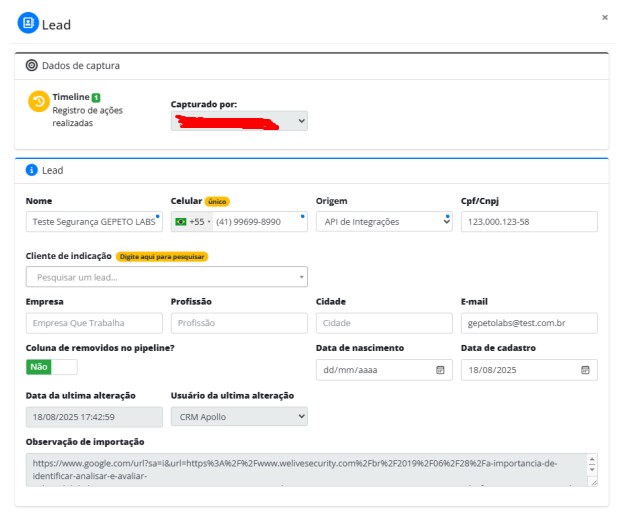

# Relatório de falha identificada no Apollo CRM via n8n e Postman

Este teste foi realizado pela empresa **Nakaya Engenharia** para avaliação da integração do Apollo com Postman e n8n. Todos os dados e resultados aqui documentados refletem o cenário de testes conduzido. A falha foi identificada enquanto era verificado a integração da API do CRM APOLLO com chamada via HTTPS via Postman & N8N. Nenhum dado ou informação sobre falhas da API & Outros foram divulgadas ou reproduzidas para fins financeiros & criminosos. A falha foi reportada para o time de TI da Ademicon & Novaquota, documentada e o especialista se dispôs a reproduzir a falha caso necessário.

> **⚠️ IMPORTANTE:** A falha já foi reportada e corrigida.

---

## 📋 Informações do Teste

- **Data:** 18/08/2025
- **Local:** Santiago - CL
- **Cliente:** Ademicon & NovaQuota
- **Matrícula:**
- **Empresa contratada:** Nakaya Engenharia
- **CNPJ:** 50.313.334-0001/93
- **Responsável de teste:** Anna S
- **Função:** Engenheiro de Dados e IA

---

## 1. Cenário de Teste

O fluxo de teste consiste no envio de leads para o Apollo usando Postman ou n8n. Os campos obrigatórios são **nome**, **email** e **celular**, enquanto os campos opcionais incluem **cpf_ou_cnpj**, **classificacao1**, **classificacao2**, **classificacao3**, **obs**, **platform** e **foto**. 

O Apollo registra leads mesmo quando há erros no body ou falhas na requisição. Para compatibilidade com o retorno do Apollo, que não é em formato JSON, é necessário converter a resposta para **Text/Raw**. Este fluxo permite detectar falhas no servidor ou banco de dados e gerar alertas automáticos para o time de TI.

---

## 2. Teste via Postman

No Postman, crie uma requisição **POST** para o endpoint do Apollo utilizando uma chave API exclusiva. Configure o cabeçalho `Content-Type` como `application/json`. 

No corpo da requisição, utilize o formato JSON contendo todos os campos do lead, incluindo nome, email, celular, classificações, observações, plataforma e foto. Envie a requisição e observe a resposta. 

**⚠️ Observação Importante:** Mesmo em casos de erro 500 ou body incorreto, o Apollo ainda registra o lead. Ajuste a visualização da resposta para **Raw/Text** para processar corretamente o retorno.

---

## 3. Automação via n8n

No n8n, crie um workflow seguindo os seguintes passos:

1. **Nó Trigger:** Configure um webhook ou outro nó de entrada para receber os dados do lead.

2. **Nó Function:** Valide e sanitize o campo `obs`, bloqueando links maliciosos e marcando alerta se necessário.

3. **Nó HTTP Request:** Configure para enviar o JSON ao Apollo:
   - Defina **Response Format** como **Text**
   - Armazene a saída em um campo específico
   - Ative **Never Error** para evitar interrupção do fluxo mesmo em caso de falha de servidor

4. **Nó IF:** Verifique se `statusCode` é diferente de 200. Se verdadeiro, dispare um nó de alerta para o time de TI via email, Slack ou WhatsApp.

5. **Nó de Log:** Registre payload, status da requisição, resposta, fotos enviadas e alertas de observação.

---

## 4. Prática de Segurança

Enquanto o time de TI corrige as falhas no servidor, recomenda-se:

- Criar uma nova branch
- Gerar uma chave API exclusiva para cada fluxo de lead

Isso garante que, em caso de vazamento, o token antigo possa ser revogado sem impactar outros processos.

---

## 5. Validação e Registro de Falhas

Monitore os seguintes tipos de erros:

- JSON mal formado
- Campos obrigatórios ausentes
- Token inválido ou expirado
- Duplicações
- Erros internos do servidor (500)

**⚠️ Atenção:** Mesmo com erro 500, o lead pode ser registrado. É fundamental manter logs completos do:
- Payload
- Resposta do servidor
- Fotos
- Alertas de observação (incluindo links maliciosos detectados)

---

## 6. Medidas de Segurança

A ausência de medidas de segurança pode levar a diversos problemas:

### Riscos Identificados

- **Token exposto:** Usuários não autorizados podem enviar leads maliciosos
- **Sobrecarga de sistema:** Pacotes não bloqueados podem causar queda ou travamento do sistema do cliente
- **Sobrecarga no banco de dados:** Inserção de dados incorretos sem validação
- **Links ou scripts maliciosos:** Campo `obs` pode comprometer sistemas internos ou permitir ataques de phishing
- **Duplicação de leads:** Payloads inválidos podem resultar em inconsistências nos relatórios e dificultar auditorias
- **Falta de visibilidade:** Sem logs completos e alertas automáticos, a equipe de TI não consegue corrigir rapidamente falhas ou detectar tentativas de exploração

---

## 7. Possível Causa de Erros no Retorno

Um comportamento observado é que o banco de dados do Apollo pode registrar os leads **imediatamente** ao receber a requisição, mas o processamento de validação e geração do retorno de resposta do body pode ocorrer **depois**. 

Isso pode causar que o servidor retorne erros de body incorreto ou 500, mesmo que o lead tenha sido salvo corretamente. Essa ordem de operações sugere que a falha não é na inserção do lead em si, mas na forma como a resposta é processada e retornada para o cliente. 

**Hipótese adicional:** Pode ter sido invertido também o banco, nesse caso ele poderia ter sido utilizado para logs e erros, mas saiu para armazenamento de leads.

---

## 8. Possíveis Correções

Para corrigir os problemas identificados, recomenda-se:

### Ajustes no Servidor

- Ajustar a ordem de processamento do servidor para validar e gerar o retorno **antes** de inserir os leads no banco de dados, garantindo que apenas dados válidos sejam registrados

- Implementar validação de payloads no lado do servidor para evitar aceitação de dados mal formados

- Retornar mensagens de erro detalhadas que permitam identificar exatamente qual campo ou informação causou falha, mantendo a consistência do log

### Segurança

- Monitorar e filtrar links ou scripts maliciosos no campo `obs` antes de salvar no banco

- Garantir que cada fluxo utilize uma chave API exclusiva e revogável para limitar impactos caso haja vazamento

### Documentação

- Atualizar a documentação e instruções de uso para que Postman e n8n enviem dados no formato correto e esperem respostas em **Text/Raw**

---

## 9. Fotos

- **Lead inserido mesmo recebendo retorno 500:**
  

---

## 📝 Conclusão

Este relatório documenta as falhas identificadas na integração do Apollo e fornece recomendações para correção. A equipe técnica está disponível para reproduzir os cenários de teste e auxiliar na implementação das melhorias sugeridas.

---

**Documento gerado por:** Nakaya Engenharia
